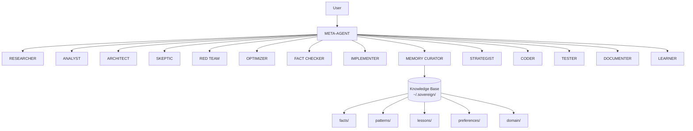

# SOVEREIGN META-AGENT

<div align="center">

```
 ____  _____ ____  _  ______     ___  ____  
/ ___|| ____/ ___|| |/ / ___|   / _ \/ ___| 
\___ \|  _|\___ \| ' / |  _   | | | \___ \ 
 ___) | |___ ___) | . \ |_| |  | |_| |___) |
|____/|_____|____/|_|\_\____|   \___/|____/ 
```

**Autonomous Intelligence, Research, Reasoning & Execution System**

*Version 4.0 — Zero-Cost, Maximum Autonomy*

[](https://opensource.org/licenses/MIT)
[](https://opencode.ai)
[](https://python.org)
[]()

</div>

---

## What is SOVEREIGN?

SOVEREIGN is a **cognitive architecture** for [opencode](https://opencode.ai) that transforms a standard AI assistant into a **multi-agent reasoning system** with persistent memory, adversarial self-critique, and structured knowledge management — all using **zero-cost tools**.

It is not a new application. It is an **agent configuration + memory system** that makes your existing opencode installation dramatically more capable.

### The Problem

Standard AI assistants:
- Forget everything between sessions
- Accept the first answer without challenging it
- Cannot maintain structured knowledge
- Have no systematic reasoning protocol
- Cannot learn from past mistakes

### The Solution

SOVEREIGN provides:
- **40 reasoning protocols** — from first-principles decomposition to second-order thinking
- **Persistent memory** — knowledge base that survives across sessions
- **Multi-agent debate** — prosecution, defense, skeptic, alternative, domain expert, implementer, judge
- **Adversarial self-critique** — systematic bias detection and falsification attempts
- **Zero-cost constraint** — every tool and resource is free, no exceptions

---

\n---\n\n## Screenshots\n\n| Preview | Description |\n|---------|-------------|\n|  | Main interface |\n|  | Demo |\n\n*Screenshots coming soon — placeholders auto-generated. Replace docs/screenshots/ with real captures.*\n\n## Features

- **META-AGENT** — Supervisory intelligence that manages the reasoning process
- **14 Specialist Agents** — Researcher, Analyst, Architect, Skeptic, Red Team, Optimizer, Fact Checker, Implementer, Memory Curator, Strategist, Coder, Tester, Documenter, Learner
- **Persistent Knowledge Base** — Facts, patterns, lessons, preferences, domain knowledge
- **Memory Consolidation** — Automated cleanup and optimization of stored knowledge
- **Tree-of-Thought** — Multiple competing hypothesis exploration
- **React-Style Agent Loop** — Observe, hypothesize, act, evaluate, update
- **Evidence Hierarchy** — 10-level evidence quality classification
- **Uncertainty Engine** — Confidence classification for all conclusions
- **Anti-Hallucination Protocol** — Systematic verification before claiming facts
- **Causal Reasoning** — Correlation vs causation analysis
- **Second-Order Thinking** — Consequence chains and feedback loops
- **Failure Mode Analysis** — Pre-execution risk assessment
- **Meta-Optimization** — Self-improving reasoning architecture

---

## Quick Start

### Prerequisites

- [opencode](https://opencode.ai) installed and configured
- Python 3.10+ (for memory consolidation utility)

### Installation

```bash
# Clone the repository
git clone https://github.com/Nortaq-PlayNexus/playnexus-sovereign-meta-agent.git

# Copy agent to opencode agents directory
cp agent/sovereign.md ~/.config/opencode/agents/

# Copy commands to opencode commands directory
cp commands/sovereign-*.md ~/.config/opencode/commands/

# Copy skill to opencode skills directory
cp -r skills/sovereign-memory ~/.config/opencode/skills/

# Initialize SOVEREIGN memory system
python scripts/consolidate.py
```

### Windows (PowerShell)

```powershell
# Clone the repository
git clone https://github.com/Nortaq-PlayNexus/playnexus-sovereign-meta-agent.git

# Copy agent to opencode agents directory
Copy-Item agent\sovereign.md $env:USERPROFILE\.config\opencode\agents\

# Copy commands to opencode commands directory
Copy-Item commands\sovereign-*.md $env:USERPROFILE\.config\opencode\commands\

# Copy skill to opencode skills directory
Copy-Item -Recurse skills\sovereign-memory $env:USERPROFILE\.config\opencode\skills\

# Initialize SOVEREIGN memory system
python scripts\consolidate.py
```

### Verify Installation

```bash
# Check agent is recognized
ls ~/.config/opencode/agents/sovereign.md

# Check memory system
ls ~/.sovereign/

# Run consolidation test
python scripts/consolidate.py --verbose
```

Restart opencode after installation. The SOVEREIGN agent will appear as a primary agent.

---

## Usage

### As Default Agent

Set SOVEREIGN as your default agent in `opencode.json`:

```json
{
  "default_agent": "sovereign"
}
```

### As Subagent

Use SOVEREIGN for specific tasks by referencing it:

```
@sovereign Analyze this codebase and identify architectural issues
```

### Commands

| Command | Description |
|---------|-------------|
| `/sovereign-save` | Save current session knowledge to persistent memory |
| `/sovereign-recall` | Retrieve relevant past knowledge |
| `/sovereign-consolidate` | Run memory consolidation and cleanup |

### Memory System

SOVEREIGN maintains a knowledge base at `~/.sovereign/`:

```
~/.sovereign/
├── knowledge/
│   ├── facts/         — Verified information
│   ├── patterns/      — Recurring solutions
│   ├── lessons/       — Mistakes and corrections
│   ├── preferences/   — User preferences
│   └── domain/        — Domain expertise
├── memory/
│   ├── sessions/      — Session summaries
│   ├── decisions/     — Key decisions
│   └── goals/         — Active goals
└── workspace/
    ├── projects/      — Project contexts
    └── artifacts/     — Generated outputs
```

### Manual Consolidation

```bash
# View memory statistics
python scripts/consolidate.py --verbose

# Dry run (preview changes)
python scripts/consolidate.py --dry-run

# Run consolidation
python scripts/consolidate.py
```

---

## How It Works

### The SOVEREIGN Reasoning Protocol

For every non-trivial task, SOVEREIGN executes:

```
UNDERSTAND → DECOMPOSE → EXPLORE → INVESTIGATE → GENERATE
    → CHALLENGE → VERIFY → SYNTHESIZE → EXECUTE → OBSERVE
    → LEARN → UPDATE MEMORY → IMPROVE PROCESS
```

### Multi-Agent Debate

When facing uncertain conclusions, SOVEREIGN spawns competing perspectives:

| Agent | Role |
|-------|------|
| **Prosecution** | Build the strongest case FOR the hypothesis |
| **Defense** | Build the strongest case AGAINST it |
| **Skeptic** | Search for hidden assumptions |
| **Alternative** | Construct a fundamentally different explanation |
| **Domain Expert** | Evaluate from subject matter expertise |
| **Implementer** | Assess practical feasibility |
| **Judge** | Compare all arguments by evidence quality |

### Self-Critique

Before finalizing any answer, SOVEREIGN systematically attacks its own result:

- Lists all assumptions
- Tests each load-bearing assumption
- Searches for confirmation bias, anchoring, availability bias
- Constructs the strongest counterexample
- Revises if the conclusion fails

---

## Architecture



---

## Documentation

| Document | Description |
|----------|-------------|
| [Installation Guide](docs/INSTALLATION.md) | Detailed setup instructions |
| [Configuration](docs/CONFIGURATION.md) | All configuration options |
| [Architecture](docs/ARCHITECTURE.md) | System design deep-dive |
| [Protocols](docs/PROTOCOLS.md) | All 40 reasoning protocols explained |
| [Troubleshooting](TROUBLESHOOTING.md) | Common issues and fixes |
| [Changelog](CHANGELOG.md) | Version history |
| [Contributing](CONTRIBUTING.md) | How to contribute |
| [Security](SECURITY.md) | Security policy |

---

## Technology Stack

| Component | Technology |
|-----------|-----------|
| Agent System | [opencode](https://opencode.ai) |
| Memory System | Local filesystem (Markdown + JSON) |
| Consolidation | Python 3.10+ |
| Configuration | JSON / JSONC |
| Knowledge Format | Markdown with structured sections |

---

## Zero-Cost Philosophy

SOVEREIGN operates under an absolute constraint: **every tool, resource, and capability must be completely free.**

| Tool | Purpose | Cost |
|------|---------|------|
| Local Filesystem | Persistent memory, knowledge base | FREE |
| Terminal/Shell | Execute commands, run code | FREE |
| Free Web Search | Research, fact-checking | FREE |
| Free Web Fetch | Read documentation, articles | FREE |
| Built-in Reasoning | All cognitive processes | FREE |
| Code Execution | Run Python, JS locally | FREE |

**Never required:** Paid API keys, subscriptions, premium tools, paid licenses, cloud services requiring payment.

---

## Roadmap

- [x] v4.0 — Core reasoning protocols
- [x] v4.0 — Persistent memory system
- [x] v4.0 — Multi-agent debate
- [x] v4.0 — Self-critique protocol
- [x] v4.0 — Memory consolidation utility
- [ ] v4.1 — Plugin system for custom specialist agents
- [ ] v4.1 — Web-based knowledge graph visualization
- [ ] v4.2 — Collaborative multi-user memory sharing
- [ ] v4.2 — Export/import knowledge bases
- [ ] v5.0 — Distributed reasoning across multiple opencode instances

---

## Contributing

Contributions are welcome. See [CONTRIBUTING.md](CONTRIBUTING.md) for guidelines.

Areas of contribution:
- Additional specialist agent definitions
- Domain-specific knowledge templates
- Memory consolidation improvements
- Documentation and tutorials
- Testing and bug reports

---

## Security

See [SECURITY.md](SECURITY.md) for the security policy.

SOVEREIGN stores all data locally. No data is sent to external services unless explicitly configured by the user through opencode's provider settings.

---

## License

MIT License — see [LICENSE](LICENSE) for details.

---

## Credits

- Built for [opencode](https://opencode.ai)
- Inspired by research on multi-agent reasoning systems, meta-cognition, and cognitive architectures
- Designed around the principle that maximum intelligence should be accessible at zero cost

---

<div align="center">

**[SOVEREIGN META-AGENT](https://github.com/Nortaq-PlayNexus/playnexus-sovereign-meta-agent)** — *Autonomous Intelligence at Zero Cost*

</div>
