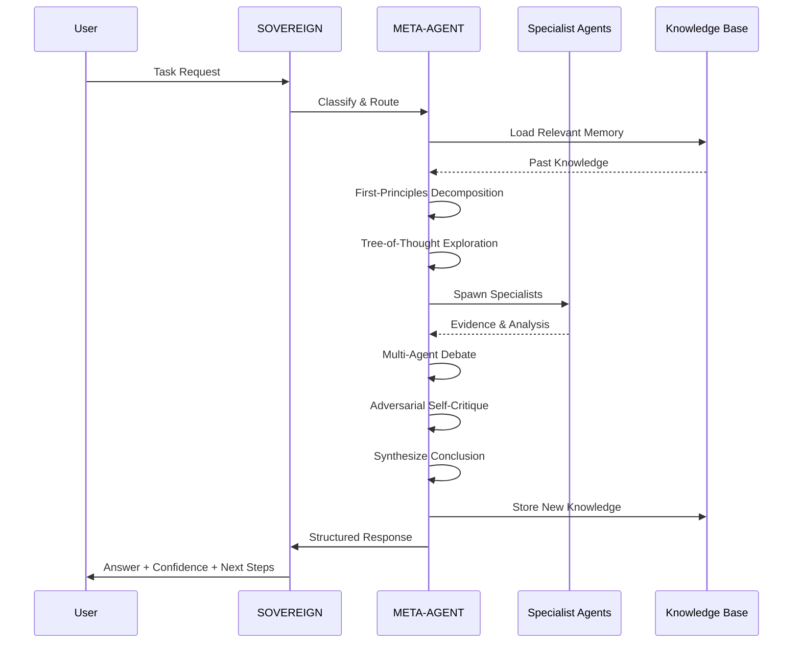
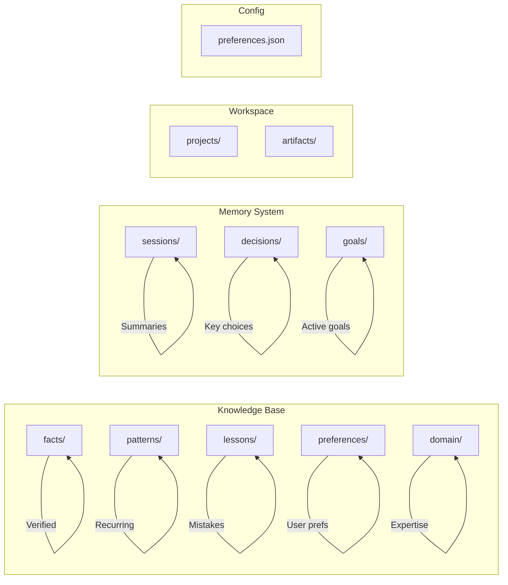

# SOVEREIGN META-AGENT — System Architecture

```mermaid
graph TB
    subgraph "User Interface"
        U[User] --> OC[opencode CLI]
    end

    subgraph "Agent Layer"
        OC --> SA[SOVEREIGN Agent<br/>24KB System Prompt]
        SA --> MA[META-AGENT<br/>Reasoning Router]
        MA --> |Classify Problem| CP{Complex?}
        CP -->|No| DR[Direct Response]
        CP -->|Yes| SP[Spawn Specialists]
    end

    subgraph "Specialist Agents"
        SP --> RE[RESEARCHER]
        SP --> AN[ANALYST]
        SP --> AR[ARCHITECT]
        SP --> SK[SKEPTIC]
        SP --> RT[RED TEAM]
        SP --> OP[OPTIMIZER]
        SP --> FC[FACT CHECKER]
        SP --> IM[IMPLEMENTER]
        SP --> MC[MEMORY CURATOR]
        SP --> ST[STRATEGIST]
        SP --> CO[CODER]
        SP --> TE[TESTER]
        SP --> DO[DOCUMENTER]
        SP --> LE[LEARNER]
    end

    subgraph "Reasoning Protocols"
        MA --> FP[First Principles]
        MA --> TOT[Tree of Thought]
        MA --> MAD[Multi-Agent Debate]
        MA --> ASC[Adversarial Self-Critique]
        MA --> RAL[React Agent Loop]
    end

    subgraph "Memory System"
        MC --> KB[(~/.sovereign/)]
        KB --> KF[knowledge/facts/]
        KB --> KP[knowledge/patterns/]
        KB --> KL[knowledge/lessons/]
        KB --> KPR[knowledge/preferences/]
        KB --> KD[knowledge/domain/]
        KB --> MS[memory/sessions/]
        KB --> MD[memory/decisions/]
        KB --> MG[memory/goals/]
    end

    subgraph "Persistence Layer"
        KB --> CON[consolidate.py]
        CON --> |Cleanup| KB
    end

    subgraph "Commands"
        OC --> CS[/sovereign-save]
        OC --> CR[/sovereign-recall]
        OC --> CC[/sovereign-consolidate]
        CS --> MC
        CR --> MC
        CC --> CON
    end

    subgraph "Tools (Free Only)"
        MA --> T1[Local Filesystem]
        MA --> T2[Terminal/Shell]
        MA --> T3[Free Web Search]
        MA --> T4[Free Web Fetch]
        MA --> T5[Code Execution]
    end

    style SA fill:#FFD700,stroke:#333
    style MA fill:#FFA500,stroke:#333
    style KB fill:#87CEEB,stroke:#333
    style CON fill:#90EE90,stroke:#333
```

## Data Flow



## Memory Architecture


